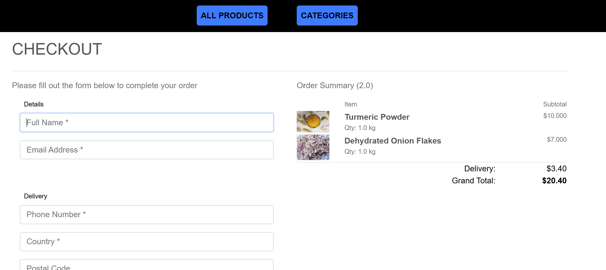
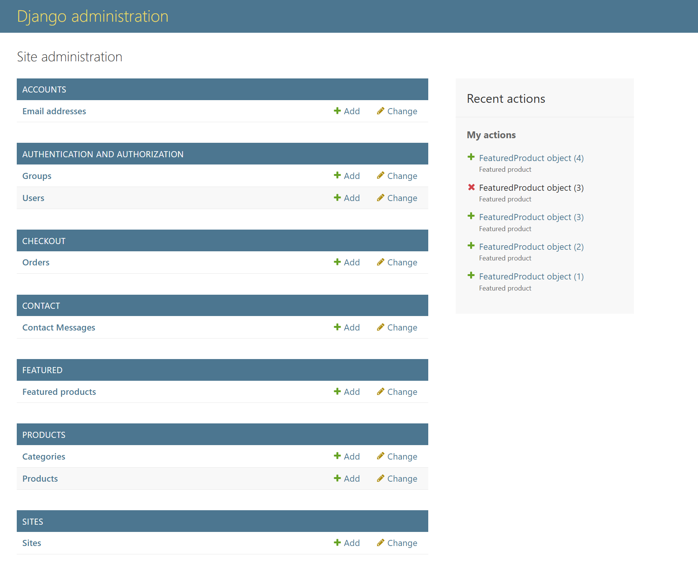

## SpiceHub Overview

The SpiceHub Application is a Django-based web application designed for users to browse, select, and purchase spices online. It provides a user-friendly interface for customers to explore products, add them to a shopping cart, and complete a secure checkout. The admin panel includes functionalities to manage products and orders effectively.


Author: Pooja Parmar

## Site Goal

To provide a seamless shopping experience for customers to browse and purchase high-quality spices. The website also allows the admin to manage products and orders efficiently.

## Features

- **Responsive Design**: The application is optimized for various screen sizes, including desktops, tablets, and mobile devices.

- **Product Browsing**: Users can explore an extensive catalog of spices with detailed descriptions and prices.


- **User Accounts**: Customers can register, log in, and manage their profiles to track orders and preferences.

- **Shopping Cart**: Users can add items to the cart, update quantities, or remove items as needed.


- **Secure Checkout**: A streamlined checkout process ensures secure transactions.



- **Admin Management**: Admins can manage products and orders via the Django Admin interface.



- **Contact Us**: User can contact for any question, feedback or query 

## Technologies Used

- **Backend**: Django (Python-based web framework)
- **Frontend**: HTML, CSS, JavaScript
- **Database**: SQLite (default; can be replaced with PostgreSQL in production)
- **Deployment**: Heroku for hosting the application
- **Other Tools**: Django Admin for product and order management

## Usage

1. **Browse Products**: Explore the catalog of available spices.
2. **Add to Cart**: Select products to add to your cart for purchase.
3. **Manage Cart**: Update product quantities or remove items as needed.
4. **Checkout**: Proceed with checkout and complete the transaction.
5. **Admin Management**: Admins can log in to manage products and view orders.

## Testing

- Manual test for python scripts

# Frontend Manual Tests

- Navigation & Content
Header & Footer: All links work; current page highlighted; logo returns to /.

Search (if present): Typing returns filtered results; empty query handled gracefully.

Messages: Success/error toasts/alerts appear and disappear appropriately after actions (add to bag, login, checkout).

- Product UI
Catalogue grid: Cards align; long names wrap; missing images show a placeholder.

Detail page: Quantity increment/decrement works; invalid qty blocked; “Add to Bag” shows confirmation.

- Bag (Cart)
Line items: Quantity updates via controls; totals recalc; remove button works.

Edge cases: Qty 0 → removes item; non-existent SKU URL does not crash (404 page).

- Checkout (Stripe test mode)
Form validation: Required fields enforced; invalid email/phone flagged.

Stripe test card: Use 4242 4242 4242 4242 (any future date, any CVC) — order succeeds; success page shows order ref.

3DS test (optional): 4000 0025 0000 3155 prompts authentication in test mode.

- Auth (allauth)
Signup: Valid and duplicate email cases; password rules; email login and username login (if both enabled).

Login/Logout: Redirects correctly; session persists; CSRF token present.

Password reset: Form sends mail (console backend locally / actual provider in prod). Confirm reset flow works.

- Profiles
Profile page: Shows saved address; can update address/phone; order history lists completed orders.

Privacy: Non-authenticated user is redirected to login when accessing profile.

- Featured
Homepage (or dedicated section): Featured products render only within active window (if your model has dates); non-featured items do not appear here.

- Responsive & Cross-browser
Breakpoints: Test at ~320px, 768px, 1024px, 1440px.

Mobile: Off-canvas menu works; tappable targets sized ≥ 44px; forms usable without zoom.

Browsers: Latest Chrome, Firefox, Safari, Edge. Check layout & checkout.


# Backend Manual Tests

- Data & Migrations
Applied migration to both, github and heroku using python command

Fixtures present: Load categories.json then products.json (local & Heroku).

Sanity: No missing table errors; /admin shows Products, Categories, Featured.


- Admin (CRUD)
Categories: Create/edit/delete; 

Products: Create with image; required fields enforced; price accepts decimals.

Featured: Create a FeaturedProduct linked to a product.

- Business Rules

Bag math: Line total = (unit price × qty); grand total sums lines; delivery charge logic applied correctly.

Checkout flow:

        Order and OrderLineItem created after payment intent succeeds.

        Order appears in admin & user profile history.

        Stock or availability rules behave as intended (if implemented).


## Deployment

This project was deployed on Heroku.

Steps for deployment:
1. Clone the repository:
   ```bash
   git clone https://github.com/pooja-par/spicehub.git

2. Install dependencies:
    pip install -r requirements.txt

3. Create a new Heroku app and link it to the repository.
4. Configure the app settings and environment variables.
5. Deploy the application using Heroku’s deployment options.

## Validator Testing
HTML: Passed through the W3C validator with no errors.
CSS: No issues found using the Jigsaw CSS validator.

## Unfixed Bugs
W3C validator shows minor warnings related to Django template syntax, which do not impact the application’s functionality.

## Credits
# Media & Content
All images and icons used in this project were sourced from:

https://unsplash.com
https://fontawesome.com
https://getbootstrap.com


