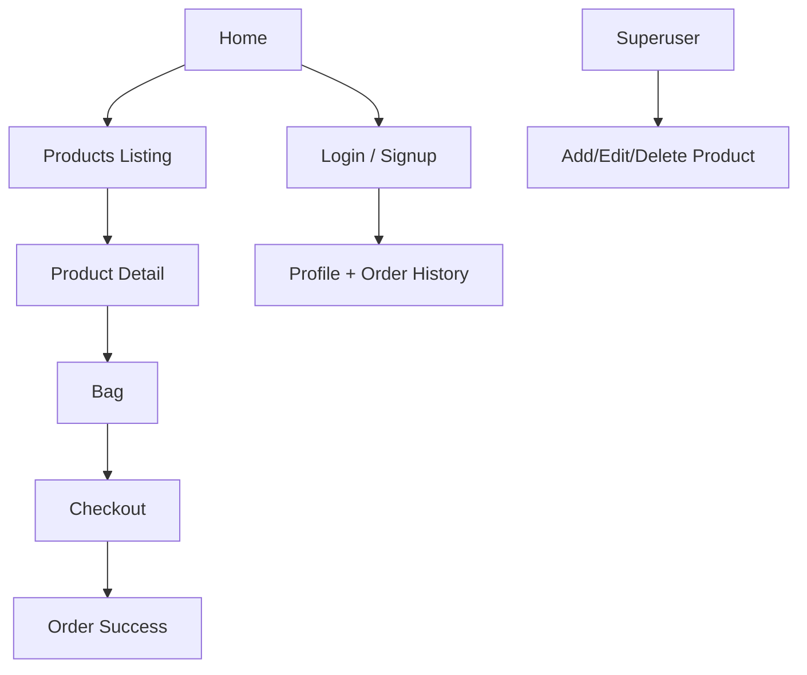

## Project 5 - SpiceHub Overview

The SpiceHub Application is a Django-based web application designed for users to browse, select, and purchase spices online. It provides a user-friendly interface for customers to explore products, add them to a shopping cart, and complete a secure checkout. The admin panel includes functionalities to manage products and orders effectively.


Author: Pooja Parmar 

## Site Goal

To provide a seamless shopping experience for customers to browse and purchase high-quality spices. The website also allows the admin to manage products and orders efficiently.

## E-commerce Business Model Documentation

SpiceHub operates as a **Business-to-Consumer (B2C) online retail model** focused on direct sales of packaged spices.

### 1) Business model type
- **Model**: B2C e-commerce store.
- **Channel**: Direct website sales through product catalogue, bag, and online checkout.
- **Customer segment**: Home cooks, food enthusiasts, and repeat household buyers.

### 2) Value proposition
- Curated, quality spice products in one online catalogue.
- Convenient ordering flow (browse → bag → checkout) without social media message-based ordering.
- Account/profile support for faster repeat purchases.

### 3) Revenue model
- **Primary revenue stream**: Product sales margin (selling price minus product sourcing/handling cost).
- **Secondary revenue support**: Repeat orders enabled through account history and saved profile data.

### 4) Cost structure
- Product sourcing and inventory cost.
- Payment processing fees (Stripe transaction charges).
- Hosting and platform operation costs (Render/cloud services).
- Marketing/customer retention activity (newsletter and social channels).

### 5) Operational flow
1. Customer discovers products via catalogue and product detail pages.
2. Customer adds items to bag and adjusts quantities.
3. Customer completes checkout via Stripe.
4. Order and order line items are stored for fulfilment and tracking.
5. Admin manages catalogue and order handling via Django admin.

### 6) Key business rules implemented in the application
- Product pricing and quantity-based bag totals drive order value.
- Secure checkout and order confirmation create trust in transaction completion.
- Superuser-only product CRUD protects catalogue integrity.
- Profile/order history improves retention through easier repeat ordering.

### 7) Success metrics (KPIs) for this model
- Conversion rate: visitors who complete checkout.
- Average order value.
- Repeat customer rate.
- Basket abandonment rate.
- Newsletter sign-up growth as a retention/remarketing signal.

### 8) Improvements (one by one)
1. Add discount/coupon strategy to increase conversion.
2. Introduce shipping-threshold incentives (e.g., free delivery above a spend limit).
3. Add product bundles (starter kits) to improve average basket size.
4. Expand lifecycle email automation (welcome, abandoned basket, reorder reminders).
5. Add analytics dashboard for KPI tracking (conversion, repeat rate, abandonment).
6. Introduce customer reviews/ratings to strengthen social proof and trust.
7. Add inventory alerts and low-stock indicators to reduce missed sales.


## Project Rationale, Target Audience, and Security

### Why this application was created
SpiceHub was created to solve a practical problem for small-to-medium spice retailers: many have product lists on social media but no structured buying journey. The project provides a dedicated e-commerce flow where customers can discover products, compare options, and complete purchases reliably in one place.

### Target audience and user stories
Primary audience:
- Home cooks and food enthusiasts seeking quality spices online.
- Returning customers who need fast repeat ordering.

Secondary audience:
- Store owners/administrators who need low-friction product and order management.

Core user stories implemented in this project:
- As a user, I can browse by category and view product details so I can choose suitable items.
- As a user, I can add/remove/update bag items so I can control my order before payment.
- As a user, I can securely checkout and receive order confirmation so I trust the transaction outcome.
- As a registered user, I can view order history and maintain profile details for future checkouts.
- As a store owner, I can create/read/update/delete products to keep catalogue data current.


### Agile planning evidence and user-story mapping

Project planning and tracking were managed using an Agile board (e.g., Trello/Jira/GitHub Projects).

- **Board URL**: `https://<your-agile-board-link>`
- **Workflow columns**: Backlog → To Do → In Progress → Review/Test → Done
- **Primary epics**: Product Catalogue, Bag/Checkout, Authentication/Profile, Marketing/SEO

| User Story ID | Story Summary | Board Card | Implementation Evidence | Status |
|---|---|---|---|---|
| US-01 | Browse and filter products | `Card: Product listing + filters` | `products/views.py` and products templates | Done |
| US-02 | Add/remove products in bag | `Card: Bag interactions` | `bag/views.py`, `bag/templates/bag/bag.html` | Done |
| US-03 | Complete Stripe checkout | `Card: Checkout + payment` | `checkout/views.py`, Stripe JS integration | Done |
| US-04 | Register/login and manage profile | `Card: Auth + profile` | allauth routes/templates, `profiles/views.py` | Done |
| US-05 | Superuser product CRUD | `Card: Product management` | add/edit/delete product views/routes | Done |
| US-06 | Newsletter signup and social reach | `Card: Newsletter + social` | newsletter app + footer signup form | Done |

> Replace placeholder Agile links/card references with your actual board URL and screenshot evidence before final submission.


### Data rationale (what data is stored and why)
The application stores only the data required to provide store functionality:
- **Catalogue data**: product names, descriptions, prices, categories, and images.
- **Transaction data**: order records and line items needed for fulfilment and audit trail.
- **Customer profile data**: delivery/contact details to improve repeat checkout usability.
- **Contact data**: customer enquiries submitted via contact form for support follow-up.

This data model supports both day-to-day operation (shopping and fulfilment) and administrative reporting in Django admin.


### Database schema (explicit model documentation)

The application uses a relational schema with these primary entities:

| Model | Purpose | Key fields | Relationships |
|---|---|---|---|
| `Category` | Product grouping and catalogue filtering | `name`, `friendly_name`, `is_active` | One-to-many with `Product` |
| `Product` | Sellable item in the store | `name`, `slug`, `price_per_kg`, `stock` | Many-to-one to `Category`; referenced by `OrderLineItem`; used by `FeaturedProduct` |
| `Order` | Checkout transaction header | `order_number`, customer/delivery fields, totals | One-to-many with `OrderLineItem`; many-to-one to `UserProfile` |
| `OrderLineItem` | Individual purchased product row | `order`, `product`, `quantity`, `lineitem_total` | Many-to-one to `Order`; many-to-one to `Product` |
| `UserProfile` | Saved delivery data and order history anchor | default address/contact fields | One-to-one with Django `User`; one-to-many with `Order` |
| `ContactMessage` | Customer enquiry/support records | `name`, `email`, `subject`, `message`, timestamps | Standalone support datastore entity |
| `FeaturedProduct` | Homepage merchandising / featured content | `product`, `start_date`, `end_date`, `is_active` | Many-to-one to `Product` |
| `NewsletterSubscriber` | Email marketing opt-in list | `email`, `created_at` | Standalone marketing datastore entity |

#### Relationship summary
- `Category (1) -> (Many) Product`
- `UserProfile (1) -> (Many) Order`
- `Order (1) -> (Many) OrderLineItem`
- `Product (1) -> (Many) OrderLineItem`
- `Product (1) -> (Many) FeaturedProduct`


### Security features and rationale
Security decisions were made to reduce common e-commerce risks:
- **Django CSRF protection** on forms to prevent forged requests.
- **Authentication and authorization controls** via allauth plus role checks for admin CRUD routes.
- **Environment-variable secrets management** for API keys and sensitive settings.
- **Stripe hosted payment handling** in test/production modes to avoid storing card details directly in app databases.
- **Server-side validation** on key forms to protect data integrity beyond client-side checks.

Together, these decisions align with the project goal of offering a trustworthy and maintainable online store experience.


## UX Design Process, Artifacts, and Implementation Traceability

### Design process followed
The UX process for SpiceHub followed an iterative path:
1. **Discovery**: define shopper and admin goals, identify pain points in social-only sales flows.
2. **Information architecture**: decide primary pages and navigation labels (Home, Products, Product Detail, Bag, Checkout, Profile, Contact).
3. **Low-fidelity wireframing**: sketch layout structure for homepage and shopping journey pages.
4. **Responsive mockups**: validate desktop and mobile composition before implementation.
5. **Implementation + review**: build Django templates/components and verify against wireframe intent during manual testing.

### UX artifacts produced

| Artifact | Purpose in design process | Evidence |
|---|---|---|
| Homepage wireframe | Establish hero content, category/product focus, and navigation priority. | `static/images/wireframehome.png` |
| Desktop mockup | Validate spacing, component hierarchy, and desktop readability. | `static/images/desktopmokup.png` |
| Mobile mockup | Validate responsive stacking, touch targets, and mobile usability. | `static/images/mobilemockup.png` |

### Design reasoning and implementation mapping

| Design Decision | UX Reasoning | Implemented Outcome |
|---|---|---|
| Prominent product discovery paths | Reduce time-to-product for first-time visitors | Product list and detail pages are available directly from primary navigation |
| Simple bag interaction model | Make quantity changes and removal obvious | Bag page supports update/remove with recalculated totals |
| Streamlined checkout form | Reduce abandonment by minimising confusion | Checkout combines required delivery fields with clear payment flow |
| Account/profile area | Improve repeat-purchase convenience | Authenticated users can review order history and stored profile data |
| Admin CRUD routes for products | Keep catalogue current without code changes | Superuser-only add/edit/delete product journeys implemented |

### User flow diagram used in implementation


```mermaid
flowchart TD
    A[Home] --> B[Products Listing]
    B --> C[Product Detail]
    C --> D[Bag]
    D --> E[Checkout]
    E --> F[Order Success]
    A --> G[Login / Signup]
    G --> H[Profile + Order History]
    I[Superuser] --> J[Add/Edit/Delete Product]
```

This flow reflects the implemented page-to-page journeys and was used as a reference to keep UI navigation and permissions consistent.


## Features

- **Responsive Design**: The application is optimized for various screen sizes, including desktops, tablets, and mobile devices.

- **Product Browsing**: Users can explore an extensive catalog of spices with detailed descriptions and prices.


- **User Accounts**: Customers can register, log in, and manage their profiles to track orders and preferences.

- **Shopping Cart**: Users can add items to the cart, update quantities, or remove items as needed.


- **Secure Checkout**: A streamlined checkout process ensures secure transactions.


- **Admin Management**: Admins can manage products and orders via the Django Admin interface.


- **Contact Us**: User can contact for any question, feedback or query 

## Social Media Page


## Technologies Used

- **Backend**: Django (Python-based web framework)
- **Frontend**: HTML, CSS, JavaScript
- **Database**: SQLite (default; can be replaced with PostgreSQL in production)
- **Deployment**:Render for hosting the application
- **Other Tools**: Django Admin for product and order management

## Usage

1. **Browse Products**: Explore the catalog of available spices.
2. **Add to Cart**: Select products to add to your cart for purchase.
3. **Manage Cart**: Update product quantities or remove items as needed.
4. **Checkout**: Proceed with checkout and complete the transaction.
5. **Admin Management**: Admins can log in to manage products and view orders.

## Testing

- Manual test for python scripts

# Frontend Manual Tests

- Navigation & Content
Header & Footer: All links work; current page highlighted; logo returns to /.

Search (if present): Typing returns filtered results; empty query handled gracefully.

Messages: Success/error toasts/alerts appear and disappear appropriately after actions (add to bag, login, checkout).

- Product UI
Catalogue grid: Cards align; long names wrap; missing images show a placeholder.

Detail page: Quantity increment/decrement works; invalid qty blocked; “Add to Bag” shows confirmation.

- Bag (Cart)
Line items: Quantity updates via controls; totals recalc; remove button works.

Edge cases: Qty 0 → removes item; non-existent SKU URL does not crash (404 page).

- Checkout (Stripe test mode)
Form validation: Required fields enforced; invalid email/phone flagged.

Stripe test card: Use 4242 4242 4242 4242 (any future date, any CVC) — order succeeds; success page shows order ref.

3DS test (optional): 4000 0025 0000 3155 prompts authentication in test mode.

- Auth (allauth)
Signup: Valid and duplicate email cases; password rules; email login and username login (if both enabled).

Login/Logout: Redirects correctly; session persists; CSRF token present.

Password reset: Form sends mail (console backend locally / actual provider in prod). Confirm reset flow works.

- Profiles
Profile page: Shows saved address; can update address/phone; order history lists completed orders.

Privacy: Non-authenticated user is redirected to login when accessing profile.

- Featured
Homepage (or dedicated section): Featured products render only within active window (if your model has dates); non-featured items do not appear here.

- Responsive & Cross-browser
Breakpoints: Test at ~320px, 768px, 1024px, 1440px.

Mobile: Off-canvas menu works; tappable targets sized ≥ 44px; forms usable without zoom.

Browsers: Latest Chrome, Firefox, Safari, Edge. Check layout & checkout.


# Backend Manual Tests

- Data & Migrations
Applied migration to both, github and Render using python command and manually on Render respectively. 

Fixtures present: Load categories.json then products.json (local & Render).

Sanity: No missing table errors; /admin shows Products, Categories, Featured.


- Admin (CRUD)
Categories: Create/edit/delete; 

Products: Create with image; required fields enforced; price accepts decimals.

Featured: Create a FeaturedProduct linked to a product.

- Business Rules

Bag math: Line total = (unit price × qty); grand total sums lines; delivery charge logic applied correctly.

Checkout flow:

        Order and OrderLineItem created after payment intent succeeds.

        Order appears in admin & user profile history.

        Stock or availability rules behave as intended.


## Local Development Setup

### Prerequisites
- Python 3.10+
- Git
- virtualenv
- Stripe account with test API keys
- Cloudinary account for media storage


### Setup Steps
1. Create and activate a virtual environment:
   ```bash
   python3 -m venv venv
   source venv/bin/activate 
   ```
2. Install dependencies:
   ```bash
   pip install -r requirements.txt
   ```
3. Set environment variables (replace with your values):
   ```bash
   export SECRET_KEY='your-secret-key'
   export STRIPE_PUBLIC_KEY='your-stripe-public-key'
   export STRIPE_SECRET_KEY='your-stripe-secret-key'
   export CLOUDINARY_CLOUD_NAME='your-cloudinary-cloud-name'
   export CLOUDINARY_API_KEY='your-cloudinary-api-key'
   export CLOUDINARY_API_SECRET='your-cloudinary-api-secret'
   ```
4. Apply database migrations:
   ```bash
   python manage.py makemigrations
   python manage.py migrate
   ```
5. Start the development server:
   ```bash
   python manage.py runserver
   ```


## Complete Deployment Procedure

### Database Strategy
### Deploy to Render (recommended)

1. Create a new **Web Service** in Render from the GitHub repository.
2. Use these build/start commands:
   - Build: `./build.sh`
   - Start: `gunicorn spicehub.wsgi:application`
3. Add environment variables:
   - `SECRET_KEY`
   - `DEBUG=False`
   - `DATABASE_URL` (Render PostgreSQL connection string)
   - `ALLOWED_HOSTS` (comma-separated, e.g. `spicehub.onrender.com`)
   - `CSRF_TRUSTED_ORIGINS` (comma-separated HTTPS origins)
   - `STRIPE_PUBLIC_KEY`, `STRIPE_SECRET_KEY`, `STRIPE_WH_SECRET` (if checkout is enabled)
   - `USE_MANIFEST_STATIC_FILES=True` (optional hardening once collectstatic is stable)
4. Provision a **Render PostgreSQL** instance and copy its internal connection string into `DATABASE_URL`.
5. Deploy the service once environment variables are set.
6. Run database migrations on the deployed instance:
   ```bash
   python manage.py migrate
   ```
7. Load initial product data (if needed):
   ```bash
   python manage.py loaddata products/fixtures/categories.json
   python manage.py loaddata products/fixtures/products.json
   ```
8. Create a superuser:
   ```bash
   python manage.py createsuperuser
   ```
9. Verify static/media configuration and confirm admin login works.


## Complete Testing Procedure

### Automated / Command-Based Checks

Run the following before release:

```bash
python manage.py check
python manage.py test
python manage.py makemigrations --check --dry-run
```

Expected outcomes:
- `check`: no system issues.
- `test`: all tests pass.
- `makemigrations --check --dry-run`: no uncommitted model changes.

### Manual Functional Testing Checklist

#### A. Core Store Journey
1. Open home page and confirm header, footer, and search are visible.
2. Open products listing and verify category filters work.
3. Open a product detail page and add product to bag.
4. Adjust quantity and verify totals update.
5. Proceed to checkout and submit test payment details.
6. Confirm order success page and order reference display.

#### B. Product Management CRUD (Superuser)
1. **Create**: add a new product from "Add Product" page.
2. **Read**: verify listing and detail page display new product.
3. **Update**: edit product details and confirm changes persist.
4. **Delete**: use delete confirmation page and verify removal from listing.

##### Explicit CRUD Evidence Table (Assessment Ready)

| CRUD | Route / Screen | Role | Test Steps | Expected Outcome | Actual Outcome | Evidence |
|---|---|---|---|---|---|---|
| Create | `/products/add/` | Superuser | Submit valid product form with name, price, stock, category | Product is created, success message shown, redirected to product detail | Pass | Screenshot + admin/product list check |
| Read | `/products/` and `/products/<slug>/` | Any user | Open product list and product detail pages | Product records are visible with correct name/price/category content | Pass | Screenshot of list/detail |
| Update | `/products/<slug>/edit/` | Superuser | Edit product name/price and submit form | Product updates persist and success message is shown | Pass | Before/after screenshot + admin check |
| Delete | `/products/<slug>/` (Delete button) | Superuser | Click Delete Product, confirm prompt, submit POST | Product is removed and user is redirected to `/products/` | Pass | Screenshot + product no longer in list/admin |

> Notes for assessor clarity:
> - `/products/add/`, `/products/<slug>/edit/`, and delete actions are intentionally restricted to superusers.
> - Anonymous users are redirected to login; non-superusers are denied access by store-owner permission checks.

#### C. Authentication and Profile
1. Register a new user account.
2. Login/logout flow works and redirects correctly.
3. Profile page loads for authenticated users.
4. Unauthenticated profile access redirects to login.

#### D. Contact and Messaging
1. Submit contact form with valid data.
2. Verify message appears in Django admin.
3. Confirm timestamp and status fields are recorded.

#### E. Responsiveness and Browser Coverage
Test in latest versions of:
- Chrome
- Edge
- Safari

Responsive breakpoints:
- 320px
- 768px
- 1024px
- 1440px

### Regression Rules
After every feature/fix:
1. Re-run `python manage.py check`.
2. Re-test product browsing, bag updates, and checkout.
3. Re-test superuser CRUD routes.
4. Confirm no broken internal links in navigation and product pages.

## Validator Testing
HTML: Passed through the W3C validator with no errors.
CSS: No issues found using the Jigsaw CSS validator.

## Credits
# Media & Content
All images and icons used in this project were sourced from:

https://unsplash.com
https://fontawesome.com
https://getbootstrap.com

## Newsletter Signup (Assessment 5.2) - Step-by-step terminal commands

Use these commands to implement and run the newsletter signup feature locally.

```bash
# 1) Move to project root
cd /workspace/spicehub

# 2) Create app scaffold
python manage.py startapp newsletter

# 3) Register app in settings
# - add 'newsletter' to INSTALLED_APPS
# - add newsletter context processor if rendering form in base template

# 4) Create model/form/view/urls/admin
# edit:
# newsletter/models.py
# newsletter/forms.py
# newsletter/views.py
# newsletter/urls.py
# newsletter/admin.py

# 5) Wire route into project urls
# edit spicehub/urls.py and include newsletter urls

# 6) Add signup form to footer/global template
# edit templates/base.html

# 7) Create migrations
python manage.py makemigrations newsletter

# 8) Apply migrations
python manage.py migrate

# 9) Run tests for newsletter
python manage.py test newsletter

# 10) Run full Django system checks
python manage.py check

# 11) Start development server
python manage.py runserver 
```
